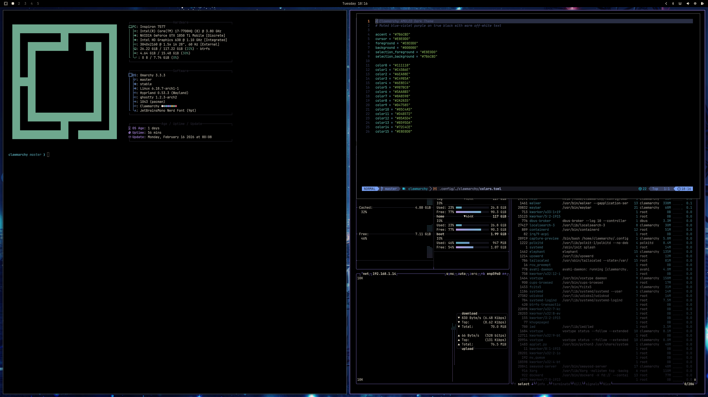

# Clawmarchy

AMOLED dark theme with 6 accent color variants and curated anime wallpapers for [Omarchy](https://omarchy.com).

## Contents

- [Install](#install)
- [Features](#features)
- [Themed Components](#themed-components)
- [Accent Variants](#accent-variants)
- [Customization](#customization)
- [Troubleshooting](#troubleshooting)
- [Compatibility](#compatibility)
- [Palette](#palette)
- [Credits](#credits)
- [Switching Themes](#switching-themes)

## Install

```
omarchy-theme-install https://github.com/AsemHub/omarchy-clawmarchy-theme
```

## Features

- **AMOLED true black** -- pure `#000000` background, no gray wash
- **6 accent variants** -- purple (default), sakura, ocean, tide, ember, and moss
- **5 anime wallpapers** -- dark atmospheric scenes paired to each accent variant
- **Custom btop gradients** -- cyan-to-magenta load mapping
- **tokyonight-night Neovim** -- AMOLED black overrides for seamless integration
- **Hyprland effects** -- purple borders, subtle shadows, smooth animations
- **Yaru-purple-dark icons** -- consistent GTK icon set

## Themed Components

```
clawmarchy/
├── colors.toml              # Color palette (source of truth)
├── hyprland.conf            # Window manager config
├── waybar.css               # Status bar styling
├── walker.css               # App launcher styling
├── mako.ini                 # Notification styling
├── swayosd.css              # Volume/brightness popups
├── hyprlock.conf            # Lock screen config
├── btop.theme               # System monitor gradients
├── neovim.lua               # Neovim color overrides
├── vscode.json              # VS Code workspace colors
├── chromium.theme           # Browser toolbar color
├── icons.theme              # GTK icon theme name
├── clawmarchy-variant       # Variant switching script
├── backgrounds/
│   ├── 1-sakura-cherry-blossoms.png
│   ├── 2-ocean-midnight-harbor.png
│   ├── 3-tide-underwater-shrine.png
│   ├── 4-ember-lantern-festival.png
│   ├── 5-moss-forest-shrine.png
│   └── qhd/                # QHD downscaled versions
└── variants/
    ├── ember/               # 9 config files per variant
    ├── moss/
    ├── ocean/
    ├── sakura/
    ├── tide/
    └── yoru/
```

All config files except `colors.toml` are static overrides. See [COLORS.md](COLORS.md) for detailed color mapping.

| File | Component | What It Controls |
|------|-----------|------------------|
| `colors.toml` | Color palette | All theme colors; read by Omarchy's template engine |
| `hyprland.conf` | Hyprland | Window borders, opacity override, blur, shadows, animations |
| `waybar.css` | Waybar | Status bar colors, accent highlights, battery/network status indicators |
| `walker.css` | Walker | App launcher AMOLED background and accent search border |
| `mako.ini` | Mako | Notification colors with urgency-based border differentiation |
| `swayosd.css` | SwayOSD | Volume/brightness popup colors |
| `hyprlock.conf` | Hyprlock | Lock screen colors, accent clock, wallpaper dimming overlay |
| `btop.theme` | btop | System monitor color gradients (cyan-to-magenta load mapping) |
| `neovim.lua` | Neovim | tokyonight-night AMOLED black background overrides |
| `vscode.json` | VS Code | 30 workspace color customizations for AMOLED black surfaces |
| `chromium.theme` | Chromium | Browser toolbar background color |
| `icons.theme` | GTK icons | Yaru-purple-dark icon set |

## Accent Variants

Clawmarchy ships with 6 accent color variants. Switch with a single command:

```
clawmarchy-variant <name>
```

| Variant | Color | Description |
|---------|-------|-------------|
| yoru | `#7B6CBD` | Muted blue-violet (default) |
| sakura | `#D4839B` | Cherry blossom pink |
| ocean | `#5B8EC9` | Deep sea blue |
| tide | `#5AB5B5` | Coastal teal |
| ember | `#D4895A` | Lantern warm orange |
| moss | `#6EA88E` | Forest green |

Run `clawmarchy-variant --list` to see all options.

## Customization

### Switching Variants

Switch between the 6 pre-built accent colors:

```
clawmarchy-variant <name>
```

This copies the variant's config files to the theme root and runs `omarchy-theme-set` to apply changes. Reload Waybar and reopen apps to see the new accent color everywhere. See the [Accent Variants](#accent-variants) table above for available options.

### Wallpapers

Theme wallpapers are in the `backgrounds/` directory:

| File | Scene | Paired Variant |
|------|-------|----------------|
| `1-sakura-cherry-blossoms.png` | Cherry blossom garden | sakura |
| `2-ocean-midnight-harbor.png` | Midnight harbor | ocean |
| `3-tide-underwater-shrine.png` | Underwater shrine | tide |
| `4-ember-lantern-festival.png` | Lantern festival | ember |
| `5-moss-forest-shrine.png` | Forest shrine | moss |

QHD (2560x1440) versions are in `backgrounds/qhd/`. Add custom wallpapers by placing PNG files in the `backgrounds/` directory.

## Troubleshooting

### Windows look slightly gray instead of true black

**Cause:** Omarchy's default opacity multiplier can override the theme's full-opacity setting.

**Fix:** Run `hyprctl reload` to pick up the theme's opacity override. Check for conflicting rules in your personal config with `hyprctl getoption decoration:active_opacity`.

### Lock screen or Waybar icons show missing characters

**Cause:** JetBrainsMono Nerd Font is not installed.

**Fix:** Install via `pacman -S ttf-jetbrains-mono-nerd` or Omarchy menu (Install > Style > Font).

### Icons don't change after installing theme

**Cause:** Icon theme not installed or needs a full logout/login.

**Fix:** Ensure the Yaru icon theme is installed. Do a full logout/login (not just `hyprctl reload`).

### VS Code still shows default Tokyo Night colors

**Cause:** Omarchy does not auto-apply `vscode.json` colorCustomizations.

**Fix:** Manually copy the `[Tokyo Night]` colorCustomizations block from `vscode.json` into VS Code's `settings.json`.

### Some apps still show old accent color after variant switch

**Cause:** Running apps cache their config at launch.

**Fix:** Reload Waybar with `killall waybar && waybar &`, then reopen terminals and editors.

## Compatibility

- **Omarchy** 3.0 or later
- **Hyprland/Wayland** (X11 not supported)
- **JetBrainsMono Nerd Font** -- used by lock screen (included with Omarchy by default)
- **Yaru-purple-dark icons** -- used by icon theme (included with Omarchy by default)
- **VS Code with Tokyo Night extension** -- optional, for editor theming

## Palette


## Credits

- Wallpapers: AI-generated via Google Gemini
- Framework: [Omarchy](https://omarchy.com) by DHH
- Neovim colorscheme: [tokyonight.nvim](https://github.com/folke/tokyonight.nvim) (tokyonight-night)
- Icons: Yaru-purple-dark

## Switching Themes

To switch to a different theme:

```
omarchy-theme-set <other-theme>
```
